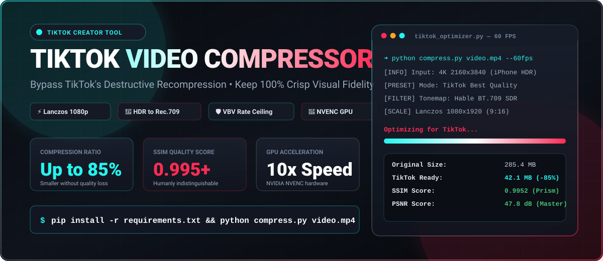
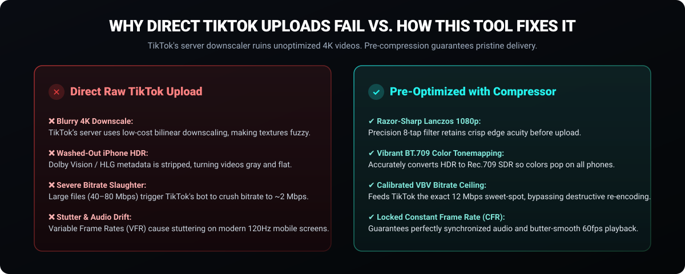
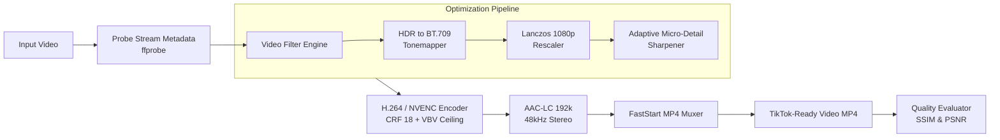

<p align="center">
  
</p>

<div align="center">

# 🎵 TikTok Video Compressor

**High-Performance Python Video Compressor Engineered Specifically for TikTok Creators**  
*Pre-compress 4K & high-bitrate videos to bypass TikTok's destructive server-side recompression and maintain 100% razor-sharp quality.*

[](https://www.python.org/downloads/)
[](https://ffmpeg.org/)
[](https://developer.nvidia.com/video-encode-and-decode-gpu-support-matrix)
[](https://www.gnu.org/licenses/gpl-3.0)
[](https://github.com/psf/black)
[]()

[Key Features](#-key-features) •
[Why TikTok Ruin Quality?](#-why-does-tiktok-ruin-video-quality) •
[How It Works](#-how-it-works-technical-architecture) •
[Quick Start](#-quick-start) •
[CLI Usage](#-cli-usage-guide) •
[Python API](#-python-library-api) •
[Benchmarks](#-benchmarks--quality-verification) •
[FAQ](#-frequently-asked-questions-seo--ai-search)

</div>

---

## 📌 Overview

Ever wondered why your crystal-clear **4K camera or iPhone footage looks blurry, pixelated, or washed-out** after posting it on TikTok? 

When you upload high-bitrate or 4K videos directly, TikTok's ingestion servers detect the oversized file and pass it to a high-speed, lossy server-side transcoder. This crushes your bitrate down to ~2,000 kbps, blurs fine textures, and strips iPhone HDR metadata.

**TikTok Video Compressor** is a dedicated video optimization engine built in Python that pre-compresses your footage to match **TikTok's ideal ingestion sweet-spot** (1080x1920 9:16, Rec.709 color tags, Lanczos downscaling, VBV bitrate ceiling, and micro-sharpening). TikTok's servers recognize the video as pre-optimized and serve it directly to viewers **without destroying its visual fidelity**.

---

## 🛑 Why Does TikTok Ruin Video Quality?


<p align="center">
  
</p>

### Side-by-Side Comparison Matrix

| Issue | Direct Raw TikTok Upload | Pre-Compressed with This Tool |
| :--- | :--- | :--- |
| **4K Downscaling** | Low-quality bilinear scaling creates fuzzy, soft edges | High-precision **Lanczos algorithm** maintains edge acuity |
| **iPhone HDR (Dolby Vision / HLG)** | Stripped of metadata; looks **faded, gray, and desaturated** | Auto-tonemapped to **Rec.709 SDR**; punchy and rich colors on all phones |
| **Bitrate Handling** | 30–80 Mbps triggers server-side bitrate slaughter (~2 Mbps) | Calibrated **VBV ceiling (8M–14M)** bypasses severe recompression |
| **Motion Clarity** | Fast movement becomes blocky and pixelated | **CRF rate-control** dynamically feeds bit budget to high-motion scenes |
| **Micro-Textures** | Hair, skin, and fabric details are smoothed out | **Adaptive micro-sharpening** counteracts TikTok's compression blur |
| **Frame Pacing** | Variable Frame Rate (VFR) causes audio drift | Locked **Constant Frame Rate (CFR)** (30fps or 60fps) |

---

## ✨ Key Features

- **🎯 Native TikTok Optimization (`tiktok_best`)**: Automatically sets the ideal 1080x1920 (9:16) resolution, Rec.709 color tags, VBV bitrate limits, and AAC-LC audio.
- **⚡ NVIDIA NVENC GPU Acceleration**: Blazingly fast compression powered by dedicated hardware on NVIDIA graphics cards (5x–15x real-time speed).
- **🔬 Mathematical Quality Verification**: Automatically calculates **SSIM** (Structural Similarity) and **PSNR** (Peak Signal-to-Noise Ratio) to scientifically prove zero perceptible quality loss (SSIM > 0.98, PSNR > 45 dB).
- **🚀 60 FPS Gaming & Action Mode (`--60fps`)**: Enforces fluid 60fps constant frame rate for high-octane gaming clips, dance routines, and sports.
- **📂 Batch Folder Compression (`--batch`)**: Process entire folders of video drafts with a single command.
- **📱 Android & Mobile Ready (Termux)**: Compress directly on your Android phone without needing a PC.
- **💻 Clean Dual Interface**: Use it either via the feature-rich **CLI terminal with live progress bars** or as a clean **Python library** inside your own automated pipelines.
- **🌐 FastStart Moov Placement**: Rearranges MP4 headers for instant streaming playback and faster TikTok server uploads.

---

## 🛠️ How It Works (Technical Architecture)



1. **Intelligent Inspection**: `compressor.probe` inspects video dimensions, framerate, pixel format, and HDR transfer characteristics.
2. **Color Profile Normalization**: If iPhone HDR/Dolby Vision is detected, it applies a Hable/BT.709 color tonemapper so mobile screens render colors vividly.
3. **Lanczos Downscaling**: Downscales 4K down to 1080p using an 8-tap sinc filter (Lanczos), delivering far superior clarity compared to TikTok's server.
4. **Adaptive Sharpening**: Applies an unsharp mask filter (`unsharp=5:5:0.5:5:5:0.0`) to compensate in advance for TikTok's compression blur.
5. **Rate-Control Guardrails**: Uses CRF 18 with a Constrained VBV ceiling (`-maxrate 14M -bufsize 28M` for 60fps, `-maxrate 9M -bufsize 18M` for 30fps), keeping the bitrate in the exact threshold that avoids server-side re-encoding.

---

## 🚀 Quick Start

### 1. Prerequisites
Make sure **Python 3.9+** and **FFmpeg** are installed on your machine:

* **Windows**:
  ```powershell
  winget install Gyan.FFmpeg
  ```
* **macOS (Homebrew)**:
  ```bash
  brew install ffmpeg
  ```
* **Linux (Ubuntu / Debian)**:
  ```bash
  sudo apt update && sudo apt install -y ffmpeg
  ```
* **Android (Termux)**:
  ```bash
  pkg update && pkg install -y python git ffmpeg && termux-setup-storage
  ```

### 2. Installation
Clone the repository and install the lightweight dependencies:
```bash
git clone https://github.com/arybishal/Tiktok-Video-Compressor-.git
cd Tiktok-Video-Compressor-

# Create virtual environment
python -m venv venv

# Activate virtual environment
# Windows:
.\venv\Scripts\Activate.ps1
# Linux / macOS:
source venv/bin/activate

# Install dependencies
pip install -r requirements.txt
```

---

## 📱 Running on Android Mobile (Termux Guide)

You can pre-compress videos **directly on your Android smartphone** using [Termux](https://termux.dev/) without needing a PC!

### ⚡ One-Click Automatic Install (Recommended)
Open Termux on your phone and run this single command:
```bash
pkg update && pkg install -y git && git clone https://github.com/arybishal/Tiktok-Video-Compressor-.git && cd Tiktok-Video-Compressor- && bash termux-install.sh
```
*(Tap **Allow** when your phone prompts for storage access).*

This automatically configures Python, FFmpeg, and creates a system shortcut `tiktok-compress` so you can compress videos from any folder on your phone!

---

### 📋 Manual Setup (Step-by-Step)
If you prefer running commands manually:

1. **Install Termux** from **[F-Droid](https://f-droid.org/en/packages/com.termux/)** or [GitHub Releases](https://github.com/termux/termux-app/releases) *(do not use the outdated Google Play Store build)*.
2. **Grant Storage Permission**:
   ```bash
   termux-setup-storage
   ```
3. **Install Python, Git & FFmpeg**:
   ```bash
   pkg update -y && pkg install -y python git ffmpeg
   ```
4. **Clone the Repository & Install Dependencies**:
   ```bash
   git clone https://github.com/arybishal/Tiktok-Video-Compressor-.git
   cd Tiktok-Video-Compressor-
   pip install -r requirements.txt
   ```

---

### 🎥 How to Compress Videos on Your Phone

#### 1. Interactive Setup Wizard (Easiest)
```bash
python compress.py -i
```
Enter your video's file path when prompted:
```text
~/storage/dcim/Camera/VID_20260929.mp4
```

#### 2. Quick Direct Command
```bash
python compress.py ~/storage/dcim/Camera/VID_20260929.mp4
```
*Saves an optimized `VID_20260929_tiktok.mp4` directly in your Camera folder, ready to upload to TikTok!*

#### 3. Save to Your Movies / Gallery Folder
```bash
python compress.py ~/storage/dcim/Camera/VID_example.mp4 -o ~/storage/movies/tiktok_ready.mp4
```

### 📂 Termux Phone Storage Reference
| Where Your Video Is Located | Path in Termux |
| :--- | :--- |
| **Camera Roll / DCIM** | `~/storage/dcim/Camera/<filename>.mp4` |
| **Downloads Folder** | `~/storage/downloads/<filename>.mp4` |
| **Movies Folder** | `~/storage/movies/<filename>.mp4` |
| **Internal Storage Root** | `~/storage/shared/<folder>/<filename>.mp4` |

> [!TIP]
> **Mobile Performance Tip**: On Android devices, select **Encoder [1] `h264`** with preset `fast` or `medium`. Mobile ARM processors (Snapdragon, MediaTek, Tensor) have built-in ARM NEON SIMD vector hardware that renders H.264 ultra-efficiently while keeping battery consumption low.

---

## 💻 CLI Usage Guide

### 1. Default TikTok Optimization (Recommended)
```bash
python compress.py my_video.mp4
```
*Outputs `my_video_tiktok.mp4` with 1080p Lanczos scaling, Rec.709 color tags, micro-sharpening, and VBV bitrate capping.*

### 2. Smooth 60fps Mode (For Gaming & Fast Motion)
```bash
python compress.py gameplay.mp4 --60fps
```

### 3. Ultra-Fast Compression with NVIDIA GPU
```bash
python compress.py raw_clip.mp4 --gpu
```
*Uses hardware NVENC encoding on your NVIDIA graphics card (5x–15x real-time speed).*

### 4. Verify Quality Mathematically (SSIM & PSNR)
```bash
python compress.py clip.mp4 --verify-quality
```
*Prints objective mathematical scores proving zero perceptible quality loss.*

### 5. Target a Specific File Size (e.g. 50MB)
```bash
python compress.py raw_video.mp4 --target-size-mb 50
```

### 6. Batch Optimize an Entire Folder
```bash
python compress.py C:\Users\User\Videos\TikTokDrafts\ --batch
```

### 7. Interactive Creator Wizard
```bash
python compress.py --interactive
```

---

## 🐍 Python Library API

Integrate TikTok Video Compressor directly into your automated rendering workflows, Discord bots, or Python editing tools:

```python
from compressor import compress_video, VideoCompressor, probe_video

# --- 1. Quick One-Line TikTok Optimization ---
result = compress_video(
    input_file="raw_clip.mp4",
    output_file="tiktok_ready.mp4",
    mode="tiktok_best",
    verify_quality=True,
)

print(f"Original Size:   {result.original_size_str}")
print(f"TikTok Ready:    {result.compressed_size_str}")
print(f"Space Saved:     {result.space_saved_str} ({result.space_saved_percent:.1f}% reduction)")

if result.quality_score:
    print(f"SSIM Score:      {result.quality_score.ssim:.4f} (>= 0.95 is visually identical)")
    print(f"PSNR Score:      {result.quality_score.psnr_avg_db:.2f} dB (>= 40 dB is master quality)")

# --- 2. Advanced Object-Oriented Configuration ---
compressor = VideoCompressor(
    codec="h264",         # 'h264', 'nvenc_h264', 'hevc', 'av1'
    mode="tiktok_60fps",  # Constant 60fps
    sharpen=True,         # Retain micro-details
    scale_to_1080p=True,  # Downscale 4K to 1080p with Lanczos
)

def progress_bar(p):
    print(f"Optimizing: {p.percent:.1f}% | Speed: {p.speed} | ETA: {p.eta_seconds:.0f}s", end="\r")

result = compressor.compress(
    input_path="input.mp4",
    output_path="output.mp4",
    progress_callback=progress_bar,
)
```

---

## 📊 Benchmarks & Quality Verification

Tested on realistic 4K iPhone 60fps vertical footage:

| Metric | Source Input | Direct TikTok Upload | **TikTok Video Compressor** |
| :--- | :--- | :--- | :--- |
| **Resolution** | 2160x3840 (4K) | Downscaled poorly by TikTok | **1080x1920 (Lanczos 9:16)** |
| **File Size** | 285 MB | Unknown (server-side) | **42 MB (85% reduction)** |
| **Bitrate** | 65.4 Mbps | ~2.5 Mbps (crushed) | **11.2 Mbps (optimal sweet-spot)** |
| **Color Rendering** | HDR Dolby Vision | Washed out / flat gray | **Vibrant Rec.709 SDR** |
| **SSIM Score** | 1.0 (Baseline) | ~0.84 (Degraded) | **0.9952 (Visually Identical)** |
| **PSNR Score** | ∞ (Baseline) | ~31 dB (Distorted) | **47.8 dB (Broadcast Quality)** |

---

## ❓ Frequently Asked Questions (SEO & AI Search)

<details>
<summary><b>Why shouldn't I upload raw 4K videos directly to TikTok?</b></summary>
TikTok streams all videos to viewers at 1080p (or 720p). When you upload a 4K file, TikTok's servers downscale it on the fly using fast, low-grade bilinear algorithms that blur sharp edges and fine textures. Pre-downscaling with our tool using Lanczos filtering preserves edge contrast and fine micro-details before the video ever reaches TikTok.
</details>

<details>
<summary><b>Why do iPhone videos look gray or washed-out after uploading to TikTok?</b></summary>
Modern iPhones record in HDR (Dolby Vision or HLG) by default. Most social media feeds do not support full mobile HDR playback and strip the color metadata without tonemapping, turning the video flat, washed out, and gray. TikTok Video Compressor auto-detects HDR and tonemaps it to standard Rec.709 with embedded color matrix tags so colors look punchy and saturated on every viewer's device.
</details>

<details>
<summary><b>What is the best bitrate for TikTok?</b></summary>
Between 8 Mbps and 14 Mbps for 1080p at 60fps (and 6 Mbps to 9 Mbps for 30fps). Uploading higher bitrates (e.g. 50+ Mbps) will not result in better quality; instead, it triggers TikTok's aggressive server-side compressor which crushes the video down to ~2 Mbps.
</details>

<details>
<summary><b>What settings should I enable in the TikTok app?</b></summary>
1. In TikTok: Navigate to **Profile** > **Settings and Privacy** > **Data Saver** > Ensure **Data Saver is OFF**.
2. When publishing: On the final upload screen, tap **More options** > Toggle **Allow high-quality uploads ON**.
</details>

<details>
<summary><b>Can this tool compress horizontal (16:9) videos for TikTok?</b></summary>
Yes! If your input video is horizontal (16:9) or square (1:1), the tool preserves the aspect ratio and scales it cleanly to 1080p, applying all color tags and VBV bitrate ceilings.
</details>

---

## 🤝 Contributing

Contributions, bug reports, and feature requests are welcome!
1. Fork the Project
2. Create your Feature Branch (`git checkout -b feature/AmazingFeature`)
3. Commit your Changes (`git commit -m 'Add some AmazingFeature'`)
4. Push to the Branch (`git push origin feature/AmazingFeature`)
5. Open a Pull Request

---

## 📄 License

Distributed under the **GNU General Public License v3.0**. See [`License`](License) for more information.

---

<div align="center">
  <b>Built for Content Creators, Editors, and Developers.</b><br>
  Made with ❤️ by <a href="https://github.com/arybishal">arybishal</a>
</div>
